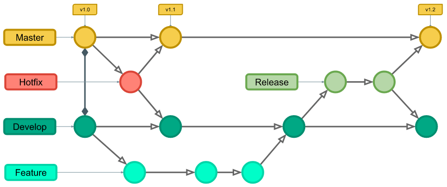

# Padrões e Técnicas Avançadas no Git Hub
## Git Flow

Git Flow é um modelo de ramificação popular que ajuda a gerenciar o desenvolvimento de software de maneira estruturada. Ele facilita o controle das diferentes fases do desenvolvimento, como novas funcionalidades, correções de bugs, releases e hotfixes. Este guia descreve o uso básico do Git Flow em um projeto.

## Estrutura de Ramificações

O Git Flow define cinco tipos principais de branches:

1. `main`: Contém o código de produção. Deve ser sempre estável.
2. `develop`: Contém o código para o próximo release. É a branch onde a integração de novas funcionalidades acontece.
3. `feature/*`: Utilizada para o desenvolvimento de novas funcionalidades.
4. `release/*`: Utilizada para preparar o novo release. Permite correções de última hora antes de ser mesclada em `main`.
5. `hotfix/*`: Utilizada para correções de bugs críticos em produção. São baseadas em `main`. 

---
# Fluxo de Trabalho GitHub Flow 

---

1. Branches Principais:
    - main: Representa a linha principal de desenvolvimento e contém apenas código estável e testado.
    - develop: É o ramo de integração, onde as contribuições individuais são mescladas antes de serem lançadas.
    ```
    # Cria feature
    git checkout develop
    # Vai para branch main
    git checkout main    
    # Mergea as atualizações
    git merge develop
    ```

2. Branches de Feature (Funcionalidade):
    - feature/{nome-da-feature}: Criados a partir do ramo develop para desenvolver novas funcionalidades. Após a conclusão, são mesclados de volta para develop.
    ```
    # Cria feature
    git checkout -b feature/{nome-da-feature}
    # Vai para branch develop
    git checkout develop
    # Mergea as atualizações
    git merge feature/{nome-da-feature}
    # excluir um branch local
    git branch -d feature/{nome-da-feature}
    # excluir um branch remoto
    git push origin --delete feature/{nome-da-feature}
    ```


3. Branches de Release (Versão):
    - release/{versão}: Ramo criado a partir de develop quando há recursos suficientes para uma versão. É usado para correções finais e preparação para lançamento. Após testes, é mesclado na main e develop, e uma tag é criada.
    ```
    # Vai para branch develop
    git checkout develop
    # Cria a release
    git checkout -b release/{versão}
    # Vai para branch develop
    git checkout develop
    # Mergea as atualizações
    git merge release/{versão}
    # Vai para branch main
    git checkout main
    # Mergea as atualizações
    git merge release/{versão}
    # Vai para branch release
    git checkout release
    # Crie uma tag
    git tag -a nome_da_tag -m "Mensagem da tag"
    ```

                
4. Branches de Hotfix (Correção Rápida):
    - hotfix/{nome-da-correcao}: Criados a partir de master para corrigir problemas críticos em produção. Assim que a correção é feita, é mesclada em master e develop, e uma tag é criada.